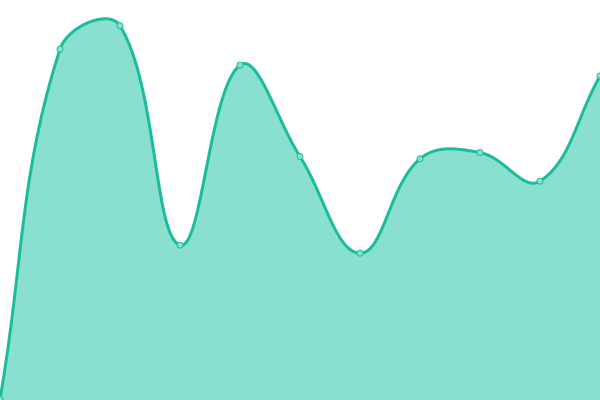
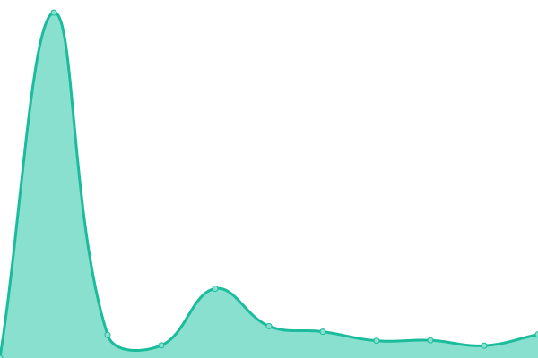

# [📈 Live Status](https://demo.upptime.js.org): <!--live status--> **🟧 Partial outage**

This repository contains the open-source uptime monitor and status page for [CVRDigital](https://demo.upptime.js.org), powered by [Upptime](https://github.com/upptime/upptime).

With [Upptime](https://upptime.js.org), you can get your own unlimited and free uptime monitor and status page, powered entirely by a GitHub repository. We use [Issues](https://github.com/CVRDigital/Upptime/issues) as incident reports, [Actions](https://github.com/CVRDigital/Upptime/actions) as uptime monitors, and [Pages](https://demo.upptime.js.org) for the status page.

<!--start: status pages-->
<!-- This summary is generated by Upptime (https://github.com/upptime/upptime) -->
<!-- Do not edit this manually, your changes will be overwritten -->
<!-- prettier-ignore -->
| URL | Status | History | Response Time | Uptime |
| --- | ------ | ------- | ------------- | ------ |
|  [Spot Inc.](https://spotinc.com) | 🟩 Up | [spot-inc.yml](https://github.com/CVRDigital/Upptime/commits/HEAD/history/spot-inc.yml) | 

 290ms
     
 | 

<a href="https://demo.upptime.js.org/history/spot-inc">100.00%</a>
    

|  [CVR](https://www.cvrindy.com) | 🟩 Up | [cvr.yml](https://github.com/CVRDigital/Upptime/commits/HEAD/history/cvr.yml) | 

 799ms
     
 | 

<a href="https://demo.upptime.js.org/history/cvr">99.37%</a>
    

|  [JGA Counsel](https://www.jgacounsel.com) | 🟩 Up | [jga-counsel.yml](https://github.com/CVRDigital/Upptime/commits/HEAD/history/jga-counsel.yml) | 

 264ms
     
 | 

<a href="https://demo.upptime.js.org/history/jga-counsel">100.00%</a>
    

|  [Reach For Youth](https://www.reachforyouth.org) | 🟥 Down | [reach-for-youth.yml](https://github.com/CVRDigital/Upptime/commits/HEAD/history/reach-for-youth.yml) | 

 428ms
     
 | 

<a href="https://demo.upptime.js.org/history/reach-for-youth">100.00%</a>
    

|  [Shiel Sexton](https://www.shielsexton.com) | 🟩 Up | [shiel-sexton.yml](https://github.com/CVRDigital/Upptime/commits/HEAD/history/shiel-sexton.yml) | 

 304ms
     
 | 

<a href="https://demo.upptime.js.org/history/shiel-sexton">100.00%</a>
    

|  [CIO Center](https://ciocenter.com) | 🟩 Up | [cio-center.yml](https://github.com/CVRDigital/Upptime/commits/HEAD/history/cio-center.yml) | 

 211ms
     
 | 

<a href="https://demo.upptime.js.org/history/cio-center">100.00%</a>
    

|  [Harney & Sons](https://www.harney.com) | 🟩 Up | [harney-and-sons.yml](https://github.com/CVRDigital/Upptime/commits/HEAD/history/harney-and-sons.yml) | 

 572ms
     
 | 

<a href="https://demo.upptime.js.org/history/harney-and-sons">100.00%</a>
    

|  [Indy Airport](https://www.ind.com) | 🟩 Up | [indy-airport.yml](https://github.com/CVRDigital/Upptime/commits/HEAD/history/indy-airport.yml) | 

 321ms
     
 | 

<a href="https://demo.upptime.js.org/history/indy-airport">100.00%</a>
    

|  [Envita Solutions](https://www.ind.com) | 🟩 Up | [envita-solutions.yml](https://github.com/CVRDigital/Upptime/commits/HEAD/history/envita-solutions.yml) | 

 142ms
     
 | 

<a href="https://demo.upptime.js.org/history/envita-solutions">100.00%</a>
    

|  [Allison Transmission](https://allisontransmission.com) | 🟩 Up | [allison-transmission.yml](https://github.com/CVRDigital/Upptime/commits/HEAD/history/allison-transmission.yml) | 

 269ms
     
 | 

<a href="https://demo.upptime.js.org/history/allison-transmission">100.00%</a>
    

|  [National Bank of Indianapolis](https://www.nbofi.com) | 🟩 Up | [national-bank-of-indianapolis.yml](https://github.com/CVRDigital/Upptime/commits/HEAD/history/national-bank-of-indianapolis.yml) | 

 410ms
     
 | 

<a href="https://demo.upptime.js.org/history/national-bank-of-indianapolis">100.00%</a>
    

<!--end: status pages-->

[**Visit our status website →**](https://demo.upptime.js.org)

## 📄 License

- Powered by: [Upptime](https://github.com/upptime/upptime)
- Code: [MIT](./LICENSE) © [Anand Chowdhary](https://anandchowdhary.com), supported by [Pabio](https://pabio.com)
- Data in the `./history` directory: [Open Database License](https://opendatacommons.org/licenses/odbl/1-0/)
